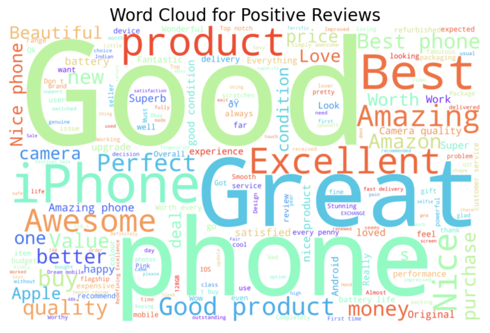
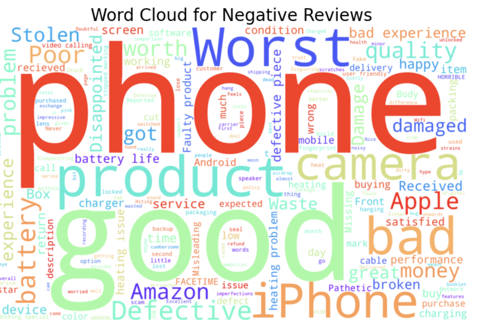

# iPhone Reviews Sentiment Analysis

This project explores customer reviews of iPhones, using natural language processing techniques to analyze sentiment and generate word clouds.

## Key Features
- **Word Clouds**: Visualize the most common words used in reviews, segmented by sentiment (positive, neutral, negative).
- **Sentiment Analysis**: Classify reviews as positive, neutral, or negative using VADER sentiment analysis.
- **Data Visualization**: Display sentiment distribution across reviews and breakdowns by country.

## Sample Visualizations

## Future Improvements
- Refine sentiment analysis by handling context (e.g., negations).
- Explore more advanced NLP techniques like BERT or LSTM models.
- Add more granular analysis based on review length, specific product features, or time trends.